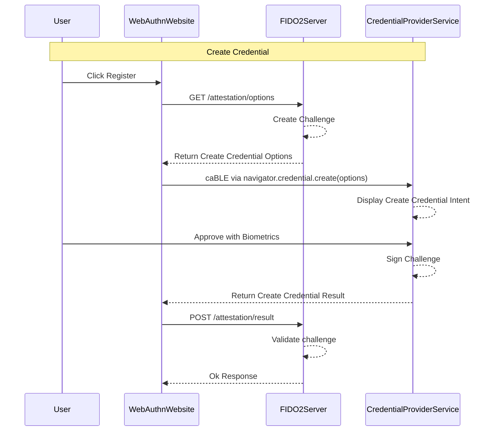

# Overview

Credential Provider Service with WebAuthn website and FIDO2 Server

```mermaid
sequenceDiagram
    participant User
    participant WebAuthnWebsite
    participant FIDO2Server
    participant CredentialProviderService
    Note over User, CredentialProviderService: Create Credential
    User->>WebAuthnWebsite: Click Register
    WebAuthnWebsite->>FIDO2Server: GET /attestation/options
    FIDO2Server-->>FIDO2Server: Create Challenge
    FIDO2Server-->>WebAuthnWebsite: Return Create Credential Options
    WebAuthnWebsite->>CredentialProviderService: caBLE via navigator.credential.create(options)
    CredentialProviderService-->>CredentialProviderService: Display Create Credential Intent
    User->>CredentialProviderService: Approve with Biometrics
    CredentialProviderService-->>CredentialProviderService: Sign Challenge
    CredentialProviderService-->>WebAuthnWebsite: Return Create Credential Result
    WebAuthnWebsite->>FIDO2Server: POST /attestation/result
    FIDO2Server-->>FIDO2Server: Validate challenge
    FIDO2Server-->>WebAuthnWebsite: Ok Response
```
