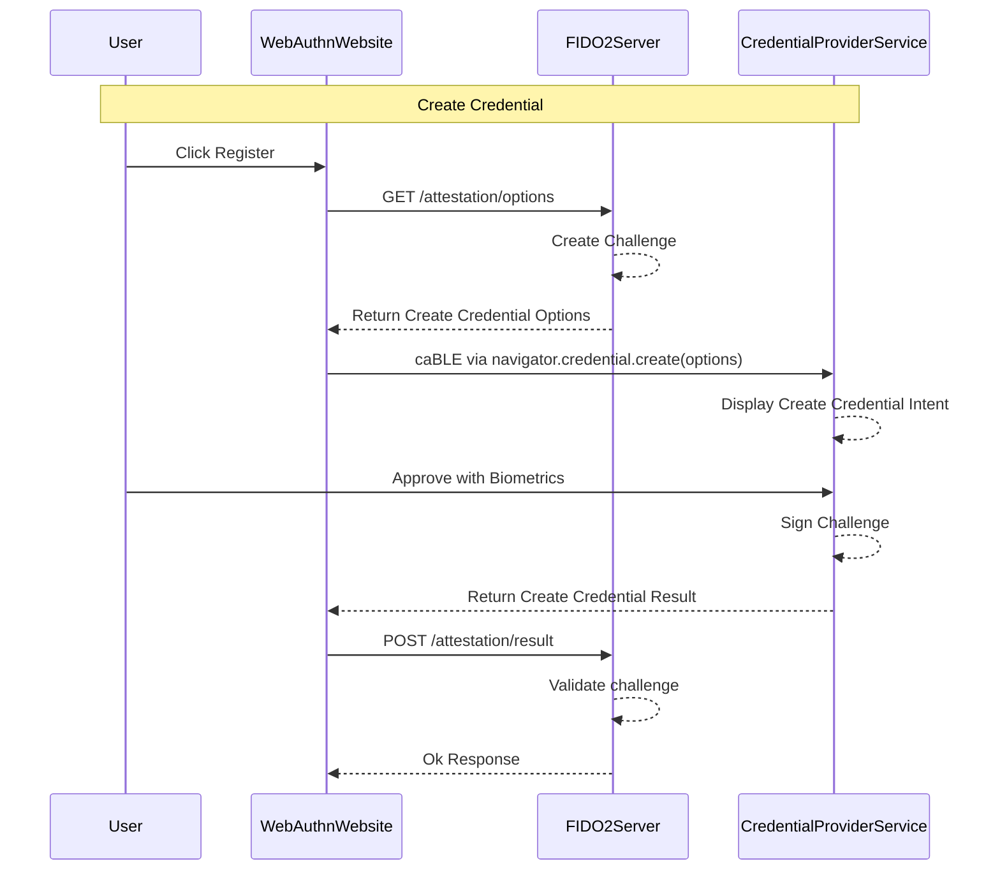

# Overview

Leverage the Android 14 `Credential Provider Service` and `Credential Manager`. Use only PublicKeyCredentials from valid FIDO2/WebAuthn enabled services

## Decisions

- Migrate from FIDO2 Client to Credential Manager
- Implement a Credential Provider Service
- Document working configurations

## Implementation

Credential Provider Service should act as a `roaming authenticator` and handle `create` and `get` operations for WebAuthn clients.

## Links

- [FIDO2 to Credential Manager Migration](https://developer.android.com/training/sign-in/fido2-migration)
- [Integrate with your provider](https://developer.android.com/training/sign-in/credential-provider)
- [Well Known Url Draft](https://github.com/ms-id-standards/MSIdentityStandardsExplainers/blob/main/PasskeyEndpointsWellKnownUrl/explainer.md#example-1)
- [Privileged Client](https://developer.android.com/training/sign-in/privileged-apps)

